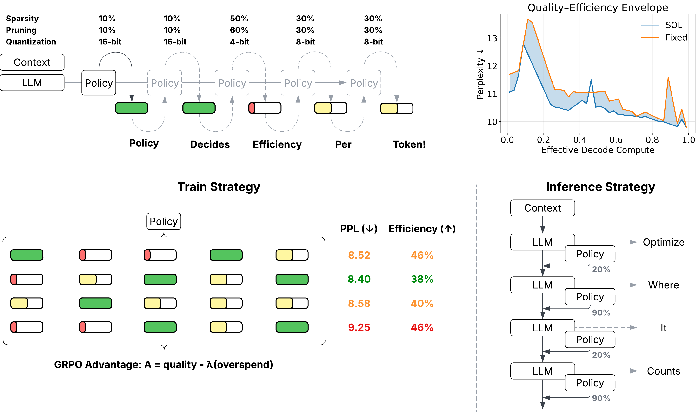

# Self Optimizing Language Models



Work on efficient Large Language Model (LLM) inference has emphasized how to make every decoding step cheaper (quantization, sparsity), but less so on how much compute each token should receive. This leaves deployments with a rigid, per-token budget that over-computes on easy tokens and under-computes on hard ones. We study step-adaptive budget allocation: learning, at generation time, how much past context to consult for each token. Concretely, we train a small policy network ($0.5\%$ of the LLM size) that reads the LLM’s hidden state and selects a discrete action $\kappa \in \{\kappa_1,\dots,\kappa_A\}$ which controls the amount of compute allocated at every decode step. The base LLM weights are unchanged. This turns inference efficiency optimization into a sequential decision problem. We show that a learned controller can allocate dense context when it matters and sparse context when it does not, meeting a specified budget while preserving quality. We also demonstrate that the policy can learn to jointly optimize for quantization, sparsity and pruning. Self-Optimizing Language Models (SOL) are able to learn to consistently out-perform static budget-allocation strategies (96\% win-rate) using the models own hidden-states, opening up an orthogonal axes of efficiency optimization previously under-studied.


## Configuration
All run-time hyperparameters are defined in `utils/config.py` via the `Config` dataclass. You can override any field by editing the config files in `official_configs/`

Key config controllers:

```yaml
model_name: meta-llama/Llama-3.2-1B
"algo": "grpo",                                    # grpo / sft
"reward_agg": null,                                # set to sum for hybrid rewards
"reward_gamma": 0.92,                              # controls the recency.
"sparsity_criteria": "quest",                      # token-sparsity method (recency / relevancy / quest)
"quest_page_size": 8,                              # page-size for quest token-sparsity
"keep_fracs": [0.2, 1.0],                          # keep fractions for token sparsity (1.0: keep everything)
"struct_prune_choices": ['s100', 's80', 's60'],    # pruning choices (supports any number 1-100 as s{keep_rate})
"quant_choices": ['q4', 'q8', 'q16'],              # quantization choices (4/8/16 bit)
"C_target": 0.5,                                   # token sparsity target (keep-rate)
"C_target_prune": 0.70,                            # llm pruning target (keep-rate)
"C_target_quant_bits": 9,                          # quantization target in bits
"enable_prune_quant": true,                        # enable pruning and quantization optimization
"grpo_level": "process",                           # process / outcome / hybrid
"task_w_kl": 0.0,                                  # 0.0 is LCE, 1.0 is DKL, can interpolate in between
"horizon": 4,                                      # look-ahead for greedy oracle (teacher)
"pi_temperature": 1.3,                             # policy temperature
"lambda_lr": 0.5,                                  # learning rate for lambda controller (identical for all)
"lambda_init": 10.0,                               # lambda-controller initialization
```

Multi-GPU is not yet supported. All our tests are run on a single Nvidia A6000 GPU.

## Training

Launch training with `torchrun` (or `python`) once a config file is prepared:
```bash
torchrun --nproc_per_node=1 --master_port 29510 train.py \
  --wandb_project SOL \
  --wandb_run_name RL_LCE_Quest4    \
  --config <base_path>/SOL/official_configs/RL_LCE_Quest4.yml
```

## Evaluation

To evaluate on perplexity metrics, use
```
python test_ckpt.py --ckpt_dir <base_path>/SOL/checkpoints/RL_LCE_Quest8_PruneQuant-20251025-164022 \
  --mode "latest" --dataset_name wikitext --sparsity_bias 0.0 --prune_bias 0.0 --quant_bias 0.0
```

Checkpoints are saved as `'policy_{text}.pt'`, where text can be checkpoint step, latest, etc. Switch between checkpoints by changing 'mode' argument.

To compare generations from policy vs dense model, run the command below, with a relatively long string in input_sentence (so that token-sparsity has some token-based pages to work with).

```
python gen_policy_vs_dense.py \
  --ckpt_dir <base_path>/SOL/checkpoints/RL_LCE_Quest8_PruneQuant-20251025-164022 \
  --input_sentence "Place long text here " \
  --generation_tokens 256 \
  --temperature 0.6 --top_p 0.9 --sparsity_bias -8 --prune_bias -3 --quant_bias -5
```

To evaluate on downstream tasks, run:

```
python eval_policy_lmeval.py   --ckpt_dir <base_path>/SOL/checkpoints/RL_LCE_Rec-20251017-162206  \
 --mode latest   --tasks hellaswag,squadv2,arc_easy,winogrande   --batch_size 8  \
   --episode_len 16 \
  --policy_temperature 0.6   --greedy_policy --dense_baseline --export_sparsity_json base_path.json 
```

This will export all results to the json path in `export_sparsity_json`.

All results used in the paper are provided in `results/` of this repository.