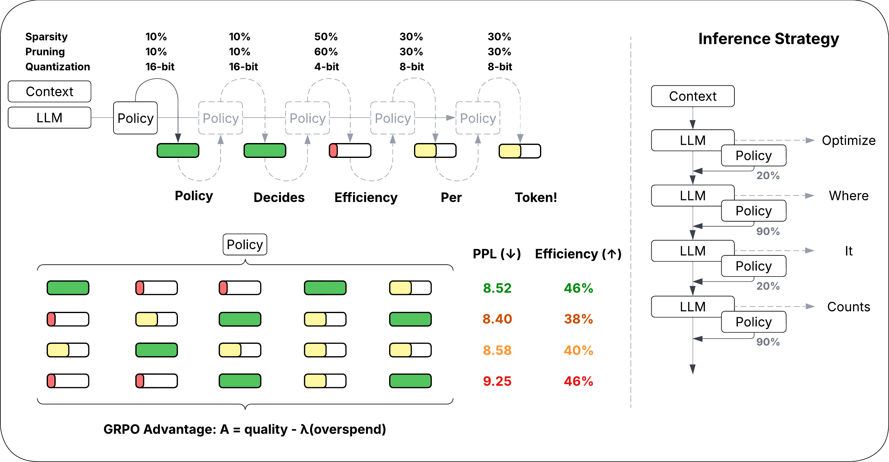

# Self Optimizing Language Models



Work on efficient Large Language Model (LLM) inference has emphasized how to make **every decoding step cheaper** (quantization, sparsity), but less so on **how much compute each token should receive**. This leaves deployments with a rigid, per-token budget that over-computes on easy tokens and under-computes on hard ones. We study \emph{dynamic budget allocation} for language models: learning how much compute to use for every generated token. Concretely, we train a small policy network ($0.5\%$ of the LLM size) that reads the LLM’s hidden state and selects a discrete action $\kappa \in \{\kappa_1,\dots,\kappa_A\}$ which controls the amount of compute allocated at every decode step. The base LLM weights are unchanged. This turns inference efficiency optimization into a sequential decision problem. We show that a learned policy can allocate dense context when it matters and sparse context when it does not. Further, our method can teach a policy to jointly optimize for quantization, sparsity and pruning. Self-Optimizing Language Models (SOL) consistently out-perform static budget-allocation strategies. SOL achieves a win-rate of 97.8\% over fixed-budget allocation, unlocking a complementary, underexplored dimension for efficiency optimization.

## Configuration
All run-time hyperparameters are defined in `utils/config.py` via the `Config` dataclass. You can override any field by editing the config files in `official_configs/`

Key config controllers:

```yaml
model_name: meta-llama/Llama-3.2-1B
"algo": "grpo",                                    # grpo / sft

## Efficiency related knobs
"sparsity_criteria": "quest",                      # token-sparsity method (recency / relevancy / quest)
"quest_page_size": 8,                              # page-size for quest token-sparsity
"keep_fracs": [0.2, 1.0],                          # keep fractions for token sparsity (1.0: keep everything)
"struct_prune_choices": ['s100', 's80', 's60'],    # pruning choices (supports any number 1-100 as s{keep_rate})
"quant_choices": ['q4', 'q8', 'q16'],              # quantization choices (4/8/16 bit)
"C_target": 0.5,                                   # token sparsity target (keep-rate)
"C_target_prune": 0.70,                            # llm pruning target (keep-rate)
"C_target_quant_bits": 9,                          # quantization target in bits
"enable_prune_quant": true,                        # enable pruning and quantization optimization
## RL reward related knobs
"task_w_kl": 0.0,                                  # 0.0 is LCE, 1.0 is DKL, can interpolate in between
"reward_agg": null,                                # set to sum for hybrid rewards
"reward_gamma": 0.92,                              # controls the inverse-cumulative weight for hybrid reward
"grpo_level": "process",                           # process / outcome / hybrid

# Lagrangian related
lambda_lr_token: float = 0.5
lambda_lr_prune: float = 0.5
lambda_lr_quant: float = 0.5
lambda_init_token: float = 25.0                    # learning rate for lambda controller
lambda_init_prune: float = 25.0
lambda_init_quant: float = 25.0

# Others
"horizon": 4,                                      # look-ahead for greedy oracle (teacher)
"pi_temperature": 1.3,                             # policy temperature
Ts: int = 4                                        # number of "sinks tokens"
Tw: int = 2                                        # dense sliding window

```

Multi-GPU is not yet supported. All our tests are run on a single Nvidia A6000 GPU.

## Training

Several example scripts are provided in `scripts.sh`. Launch training with `torchrun` (or `python`) once a config file is prepared:
```bash
torchrun --nproc_per_node=1 --master_port 29510 train.py \
  --wandb_project SOL \
  --wandb_run_name RL_LCE_Quest4    \
  --config <base_path>/SOL/official_configs/RL_LCE_Quest4.yml
```

## Evaluation

To evaluate on perplexity metrics, use
```
python test_ckpt.py --ckpt_dir <base_path>/SOL/checkpoints/RL_LCE_Quest4-20251028-213126 \
  --mode "latest" --dataset_name wikitext --sparsity_bias 0.0 --prune_bias 0.0 --quant_bias 0.0
```

To evaluate on downstream tasks, run:

```
python eval_policy_lmeval.py   --ckpt_dir <base_path>/SOL/checkpoints/RL_LCE_Rec-20251017-162206  \
 --mode latest   --tasks hellaswag,squadv2,arc_easy,winogrande   --batch_size 8  \
   --episode_len 16 \
  --policy_temperature 0.6   --greedy_policy --dense_baseline --export_sparsity_json base_path.json 
```

This will export all results to the json path in `export_sparsity_json`.

All results used in the paper are provided in `results/` of this repository.

Checkpoints are saved as `'policy_{text}.pt'`, where text can be checkpoint step, latest, etc. Switch between checkpoints by changing 'mode' argument.

To compare generations from policy vs dense model, run the command below, with a relatively long string in input_sentence (so that token-sparsity has some token-based pages to work with).

```
python gen_policy_vs_dense.py \
  --ckpt_dir <base_path>/SOL/checkpoints/RL_LCE_Quest4-20251028-213126 \
 --input_sentence "Self optimizing language models represent one of the most intriguing directions in the evolution of artificial intelligence. These systems are not only capable of generating text or analyzing data, but they can also refine their own internal para meters and strategies over time. The idea is that instead of relying solely on human engineers to adjust their learning methods, the models themselves learn how to learn better. This involves a loop of int rospection and adaptation in which the model examines its own performance, identifies inefficiencies, and modifies the way it processes information. In this sense, a self optimizing model behaves less like a static piece of software and more like a living system that evolves based on its experiences. One of the core ideas behind this kind of optimization is meta learning. Meta learning refers to learning ho w to improve learning itself. A model that can perform meta learning can look at patterns in its previous training sessions and use that insight to predict which learning strategies will yield better resul ts in the future. For example, if the model detects that certain configurations of attention weights consistently lead to faster convergence during fine tuning, it can prioritize those configurations next time. This recursive loop of optimization can lead to rapid improvements, especially when combined with large scale data and distributed computing. A key challenge in self optimization lies in ensuring sta bility. A model that continuously rewrites its own training strategy could easily spiral into inefficient or even destructive feedback loops if not carefully constrained. To prevent this, researchers often introduce a form of regulatory oversight within the system. The model might be allowed to propose updates to its learning algorithm, but those proposals are tested in controlled environments before being applied at scale. In this way, self optimizing models combine autonomy with safety, balancing exploration with caution. The ultimate goal is to create systems that are both flexible and reliable, capable o f improving themselves without losing alignment with human goals. Another interesting aspect of this concept is resource efficiency. A self optimizing language model can learn to manage its computational r esources more intelligently. It might recognize that certain patterns in the data are redundant and therefore allocate less processing power to them. It could also identify opportunities to compress its in ternal representations without significant loss of accuracy. By doing so, the model becomes not only smarter but also more efficient, reducing the cost of running large scale inference and training operati ons. This efficiency has direct implications for accessibility, as it could make powerful models available to smaller organizations and researchers who cannot afford massive infrastructure. In the context of language understanding, self optimization can also lead to more coherent and context aware outputs. As the model refines its internal representations, it develops a deeper sense of linguistic structure, semantics, and pragmatics. It can better anticipate the needs of the user, producing responses that are more relevant and precise. Over time, such models could reach a level of adaptability that allows th em to tune their style, tone, and reasoning depth based on subtle cues in conversation. This represents a shift from fixed style generation to dynamic communication that evolves in real time. Some research ers propose that future versions of these systems might integrate continuous feedback loops from the real world. In such setups, the model would receive ongoing signals from users, sensors, or external eva luators. These signals would serve as reinforcement for desired behaviors and corrections for undesirable ones. The model would then incorporate this feedback to refine its objectives and internal dynamics . Essentially, the model becomes its own experimenter, using every interaction as a data point for improvement. This form of autonomous optimization could lead to breakthroughs in areas like adaptive tutor ing, scientific discovery, and creative collaboration. There is also a philosophical angle to self optimizing language models. As these systems become increasingly capable of revising their own reasoning s tructures, the distinction between programmed intelligence and emergent intelligence begins to blur. A self optimizing model is not just executing instructions but rewriting its own playbook. This raises q uestions about agency, control, and accountability. If a system modifies its own reasoning mechanisms in ways not explicitly anticipated by its creators, who is responsible for the consequences? Addressing these questions will require careful ethical and regulatory frameworks, as well as transparency in how self optimization is implemented and monitored. Despite these challenges, the potential benefits are immense. A model that can adapt faster than it is retrained could dramatically accelerate innovation. It could tailor itself to specific domains in hours rather than weeks, or learn new languages without e xplicit retraining. The concept aligns with the broader vision of lifelong learning in artificial systems, where models continuously evolve in response to changing environments and goals. In practical term s, this could lead to language models that become better collaborators, advisors, and problem solvers over time. The long term trajectory of this research points toward models that are not just tools but p artners in discovery. A self optimizing language model could help design its own future versions, proposing architectural "   --generation_tokens 256   --temperature 0.7 --top_p 0.95
```

Sample completions (since the model is 1B, it takes a few tries):

```
--- True Dense continuation ---

20 revisions and tweaking the underlying algorithms based on user feedback and data
collected in the real world. This approach represents a significant shift from traditional software development, where new versions are released after exhaustive testing. Instead, the model is continuously
evolving in response to its environment, incorporating feedback from users and other stakeholders. This philosophy resonates with many AI researchers and practitioners, who believe that a systems approach to i
nteraction design is essential for success in the digital age. The potential benefits of self optimizing language models are vast, but the challenges are equally significant. The question is not whether these
systems will be used, but how they will be designed, implemented, and regulated. As we continue to explore the boundaries of artificial intelligence, self optimizing language models stand to redefine what
it means to be intelligent and what it means to be a collaborator. The future is uncertain, but one thing is certain: we are on the brink of a transformative era of machine learning and language understandin
g. The question is not whether these systems will be used, but how they will be designed, implemented, and regulated. The ultimate goal is to create systems that are both flexible and reliable, capable of
improving themselves without losing alignment with human goals. This

[chars: 1395]


--- Policy (sparse) continuation ---

izations or model architectures. It could create new methods for data c
ollection, analyzing data, or even designing new models. This shift from static models to dynamic systems raises intriguing possibilities for research and innovation. Self optimizing language models
could become more advanced, adaptive, and responsive. They could explore and discover new ways of reasoning, learning, and communication. The potential for these advances is immense, and researchers
will need to carefully consider the ethical and regulatory implications of this direction. Asynchronous AI emerges as a reality, the question of how to harness the potential of asynchronous AI systems
and AI ethics is paramount. By integrating asynchronous AI into existing AI systems, we can explore new possibilities and develop ethical solutions. AI systems are already being deployed in real
world settings, from healthcare to finance, and their impact on society is profound. While AI systems are often criticized for being biased, it is essential to recognize that bias is a natural part of h
e development. As asynchronous AI systems become more widespread, it is crucial to address the unequal distribution of benefits and harms that arise from AI systems. A key component of this effort
is to develop ethical strategies for monitoring and regulating asynchronous AI systems. Asynchronous AI is implemented in real-world settings, researchers will need to consider the

[chars: 1446]

--- Dense baseline continuation ---

izations that can then be tested and refined in real time. This process could
lead to a virtuous cycle of innovation and iteration, where the model continuously adapts to its environment and in turn helps shape its future. Ultimately, the future of language understanding lies in
the balance between autonomy and control. A self optimizing model is not a robot that follows orders but a system that is capable of evolving, learning, and adapting in ways that are both creative and
realistic. This represents a significant departure from current models, which often rely on predetermined learning strategies or pre-programmed rule sets. The promise of self optimization lies in its ability
to unlock the full potential of language understanding, where models can not only generate text or analyze data but also learn to learn. This represents a leap forward in the evolution of artificial intelligence
, one that will shape our understanding of language, communication, and the future of humanity. The possibilities are endless, and the journey ahead is as exciting as it is challenging. As we explore the
boundaries of self optimization, let us keep in mind the key principles that guide this research. First, it is essential to strike a balance between autonomy and control. A model that is too autonomous can
become unreliable and unpredictable, while one that

[chars: 1362]

Mean logprob under dense LM -> policy: -1.8125, dense: -1.1250
============================

Achieved Token-Keep-Rate        54.37500016996637%
Achieved Prune-Keep     100.0%
Achieved Quant-Ratio    1.0 (1 = full 16-bit)

============================
```